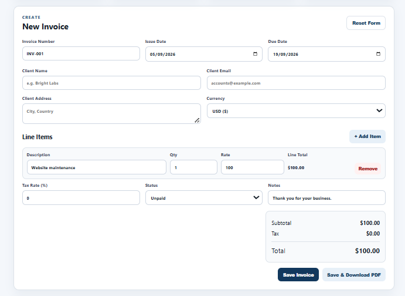
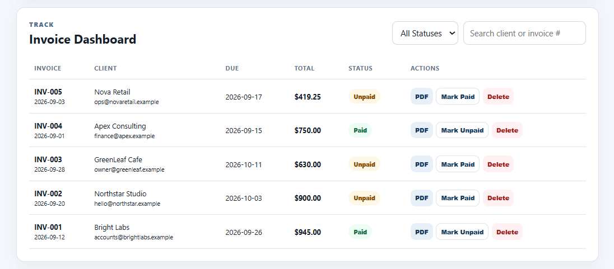
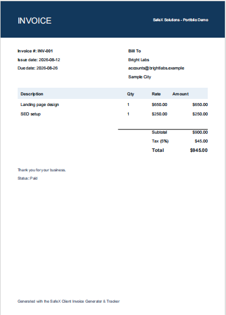

# SafeX Invoice Generator & Tracker

**SafeX Solutions Internship - Week 3 Portfolio Project**
**Name:** Aamna Karam
**Internship category:** Web Development (Group 1)

## Problem Statement
Freelancers and small agencies often create invoices manually in Word or Excel. That process is repetitive, formatting can be inconsistent, and it is easy to lose track of which invoices are paid, unpaid, or overdue.

## Solution
This project is a browser-based invoice generator and tracker. A user can create an invoice from a form, add multiple line items, apply tax, save invoice records in browser `localStorage`, download a branded PDF, and monitor paid/unpaid/overdue invoices from a dashboard.

## Key Features
- Form-driven invoice builder
- Multiple line items with automatic subtotal, tax, and total calculations
- Client-side PDF export using jsPDF
- Browser localStorage persistence
- Paid / unpaid status tracking
- Automatic overdue highlighting based on due date
- Paid vs unpaid revenue summary cards
- Search and status filters
- Simple client list generated from invoice records
- Five demo invoices for testing
- Responsive layout for desktop and mobile

## Screenshots

**Invoice builder**


**Dashboard with paid, unpaid, and overdue invoices**


**Generated PDF invoice**


## Research Notes (Day 1)
I reviewed the invoice structures used by Wave, Invoice Ninja, and Bonsai. Common conventions include a unique invoice number, invoice and due dates, business/client information, itemized products or services, quantity/hours, unit rate, tax/discount handling, totals, payment status, and notes/terms. I used these conventions to define the schema and PDF layout for this project.

References:
- Wave Developer invoice fields: https://www.waveapps.com/invoicing
- Invoice Ninja invoice guide: https://www.invoiceninja.com
- Bonsai invoice template guidance: https://www.hellobonsai.com/invoice-template

## Invoice Data Schema
```text
id
number
issueDate
dueDate
clientName
clientEmail
clientAddress
currency
items[] -> description, quantity, rate
taxRate
subtotal
tax
total
status
notes
```

## Tools & Technologies
- HTML5
- CSS3
- Vanilla JavaScript
- jsPDF 2.5.1 (CDN)
- Browser localStorage
- GitHub + GitHub Pages for hosting

## How to Run Locally
1. Download or clone the repository.
2. Open `index.html` in a browser.
3. Click **Load Demo Data** to populate five test invoices.
4. Create an invoice and click **Save & Download PDF**.

> PDF export uses a CDN version of jsPDF, so the browser needs internet access when loading the page unless you later bundle the library locally.

## Testing Completed
I tested five invoices with different due dates and statuses. I checked:
- correct line-item calculations
- tax calculations
- total invoice values
- paid/unpaid revenue summaries
- overdue status when an unpaid invoice passes its due date
- dashboard filters and search
- PDF download output
- client list generation

## Weaknesses Found and Fixed
1. **First version risk: data disappeared on refresh.** Fixed by storing invoices in `localStorage` rather than only temporary memory.
2. **First version risk: unpaid invoices looked the same even after the due date.** Fixed by calculating an `Overdue` display status automatically from the due date.
3. **First version risk: dashboard became hard to scan with more invoices.** Fixed by adding status filtering and client/invoice search.

## Challenges and How I Solved Them
### Dynamic line items
Each invoice can have several services. I used reusable line-item rows and recalculated totals whenever quantity, rate, or tax changed.

### Overdue logic
An invoice should only be overdue if it is not paid and its due date is in the past. I created a helper function that checks both conditions every time the dashboard renders.

### PDF formatting
The PDF needs to look different from a raw webpage screenshot. I created a dedicated jsPDF layout with a branded header, client details, item table, totals, notes, and status.

## Future Improvements
- Editable invoices instead of only create/delete
- Company logo upload and customizable brand colors
- Discount field and per-line tax support
- Payment links / email reminders
- Backend database, authentication, and cloud sync
- CSV export and monthly revenue charts
- Multi-currency reporting with exchange-rate handling

## Portfolio Summary
**Project:** Client Invoice Generator & Tracker  
**Problem:** Manual invoice formatting wastes time and makes payment tracking difficult.  
**Solution:** A lightweight web tool for invoice creation, PDF export, status tracking, overdue alerts, revenue totals, and client management.  
**Result:** A reusable frontend utility that could be adapted into an internal SafeX tool or expanded into a SaaS product.

## Deployment - GitHub Pages
1. Create a new GitHub repository, for example `Safex Invoice Tracker`.
2. Upload `index.html`, `style.css`, and `app.js` (plus this README).
3. In the repository, open **Settings > Pages**.
4. Under **Build and deployment**, choose **Deploy from a branch**.
5. Select the `main` branch and `/ (root)`, then save.
6. Wait for GitHub to show the public site URL, then test it in an incognito/private window.

## Links
- **Live tool:** https://aminathedeveloper.github.io/Safex-Invoice-Tracker/
- **Source code:** https://github.com/AminaTheDeveloper/Safex-Invoice-Tracker

## Evaluation Mapping
- **Problem understanding (15%)**: problem statement + research
- **Research (10%)**: Wave / Invoice Ninja / Bonsai conventions
- **Implementation (25%)**: builder, calculations, PDF, localStorage, dashboard
- **Professional quality & UX (20%)**: responsive UI, filters, summary cards, branded PDF
- **Problem-solving (15%)**: weaknesses found/fixed + challenge notes
- **Documentation (5%)**: this README
- **Portfolio presentation (5%)**: live link + repo + screenshots/sample PDFs
- **Final video (5%)**: walkthrough outline above(I didn't capture the video)